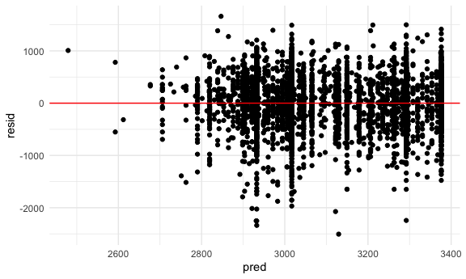
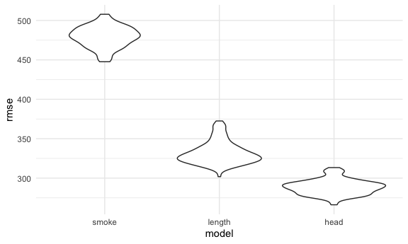
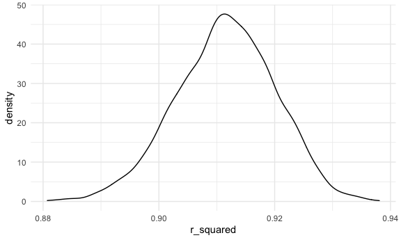
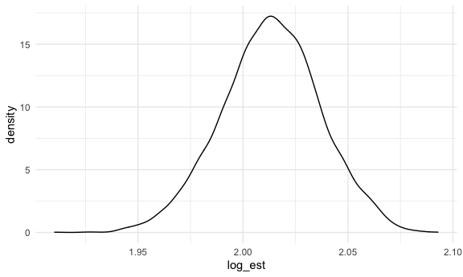

Hw6
================

``` r
library(tidyverse)
```

    ## ── Attaching packages ─────────────────────────────────────── tidyverse 1.3.1 ──

    ## ✓ ggplot2 3.3.5     ✓ purrr   0.3.4
    ## ✓ tibble  3.1.4     ✓ dplyr   1.0.7
    ## ✓ tidyr   1.1.3     ✓ stringr 1.4.0
    ## ✓ readr   2.0.1     ✓ forcats 0.5.1

    ## ── Conflicts ────────────────────────────────────────── tidyverse_conflicts() ──
    ## x dplyr::filter() masks stats::filter()
    ## x dplyr::lag()    masks stats::lag()

``` r
library(viridis)
```

    ## Loading required package: viridisLite

``` r
library(modelr)
library(mgcv)
```

    ## Loading required package: nlme

    ## 
    ## Attaching package: 'nlme'

    ## The following object is masked from 'package:dplyr':
    ## 
    ##     collapse

    ## This is mgcv 1.8-36. For overview type 'help("mgcv-package")'.

``` r
knitr::opts_chunk$set(
  fig.width = 6,
  fig.asp = .6,
  out.width = "90%"
)

theme_set(theme_minimal() + theme(legend.position = "bottom"))

options(
  ggplot2.continuous.colour = "viridis",
  ggplot2.continuous.fill = "viridis"
)

scale_colour_discrete = scale_colour_viridis_d
scale_fill_discrete = scale_fill_viridis_d
```

\#\#Problem 1

``` r
bwt_df <- read_csv("birthweight.csv", col_types = "fnnnnnfnfnnnfnnnnnnn")
summary(bwt_df)
```

    ##  babysex      bhead          blength           bwt           delwt      
    ##  2:2112   Min.   :21.00   Min.   :20.00   Min.   : 595   Min.   : 86.0  
    ##  1:2230   1st Qu.:33.00   1st Qu.:48.00   1st Qu.:2807   1st Qu.:131.0  
    ##           Median :34.00   Median :50.00   Median :3132   Median :143.0  
    ##           Mean   :33.65   Mean   :49.75   Mean   :3114   Mean   :145.6  
    ##           3rd Qu.:35.00   3rd Qu.:51.00   3rd Qu.:3459   3rd Qu.:157.0  
    ##           Max.   :41.00   Max.   :63.00   Max.   :4791   Max.   :334.0  
    ##     fincome      frace       gaweeks      malform     menarche    
    ##  Min.   : 0.00   1:2123   Min.   :17.70   0:4327   Min.   : 0.00  
    ##  1st Qu.:25.00   2:1911   1st Qu.:38.30   1:  15   1st Qu.:12.00  
    ##  Median :35.00   3:  46   Median :39.90            Median :12.00  
    ##  Mean   :44.11   4: 248   Mean   :39.43            Mean   :12.51  
    ##  3rd Qu.:65.00   8:  14   3rd Qu.:41.10            3rd Qu.:13.00  
    ##  Max.   :96.00            Max.   :51.30            Max.   :19.00  
    ##     mheight          momage     mrace        parity            pnumlbw 
    ##  Min.   :48.00   Min.   :12.0   1:2147   Min.   :0.000000   Min.   :0  
    ##  1st Qu.:62.00   1st Qu.:18.0   2:1909   1st Qu.:0.000000   1st Qu.:0  
    ##  Median :63.00   Median :20.0   3:  43   Median :0.000000   Median :0  
    ##  Mean   :63.49   Mean   :20.3   4: 243   Mean   :0.002303   Mean   :0  
    ##  3rd Qu.:65.00   3rd Qu.:22.0            3rd Qu.:0.000000   3rd Qu.:0  
    ##  Max.   :77.00   Max.   :44.0            Max.   :6.000000   Max.   :0  
    ##     pnumsga      ppbmi            ppwt           smoken           wtgain      
    ##  Min.   :0   Min.   :13.07   Min.   : 70.0   Min.   : 0.000   Min.   :-46.00  
    ##  1st Qu.:0   1st Qu.:19.53   1st Qu.:110.0   1st Qu.: 0.000   1st Qu.: 15.00  
    ##  Median :0   Median :21.03   Median :120.0   Median : 0.000   Median : 22.00  
    ##  Mean   :0   Mean   :21.57   Mean   :123.5   Mean   : 4.145   Mean   : 22.08  
    ##  3rd Qu.:0   3rd Qu.:22.91   3rd Qu.:134.0   3rd Qu.: 5.000   3rd Qu.: 28.00  
    ##  Max.   :0   Max.   :46.10   Max.   :287.0   Max.   :60.000   Max.   : 89.00

``` r
sum(is.na(bwt_df))
```

    ## [1] 0

The smoke\_fit model attempts to use babysex mrace and frace as
citnroling factors to determine relationship between smoked and bwt.

``` r
smoke_fit <- lm(bwt ~ babysex + mrace + frace + smoken, data = bwt_df)
broom::glance(smoke_fit)
```

    ## # A tibble: 1 × 12
    ##   r.squared adj.r.squared sigma statistic   p.value    df  logLik    AIC    BIC
    ##       <dbl>         <dbl> <dbl>     <dbl>     <dbl> <dbl>   <dbl>  <dbl>  <dbl>
    ## 1     0.121         0.119  481.      66.4 8.47e-115     9 -32968. 65959. 66029.
    ## # … with 3 more variables: deviance <dbl>, df.residual <int>, nobs <int>

``` r
broom::tidy(smoke_fit)
```

    ## # A tibble: 10 × 5
    ##    term        estimate std.error statistic  p.value
    ##    <chr>          <dbl>     <dbl>     <dbl>    <dbl>
    ##  1 (Intercept) 3292.        14.3  230.      0       
    ##  2 babysex1      84.2       14.6    5.76    8.81e- 9
    ##  3 mrace2      -279.        81.0   -3.45    5.76e- 4
    ##  4 mrace3      -166.       126.    -1.32    1.88e- 1
    ##  5 mrace4      -166.        79.1   -2.10    3.59e- 2
    ##  6 frace2       -80.4       81.1   -0.992   3.21e- 1
    ##  7 frace3       -30.7      122.    -0.252   8.01e- 1
    ##  8 frace4       -80.8       78.7   -1.03    3.04e- 1
    ##  9 frace8         0.299    130.     0.00229 9.98e- 1
    ## 10 smoken       -11.3        1.02 -11.1     2.75e-28

``` r
bwt_df %>% 
  add_predictions(smoke_fit) %>% 
  add_residuals(smoke_fit) %>% 
  ggplot(aes(x = pred, y = resid)) +
  geom_point() +
  geom_hline(yintercept = 0, color = "red")
```


Comparing models,

``` r
length_fit <- lm(bwt ~ blength + gaweeks, data = bwt_df)
head_fit <- lm(bwt ~ bhead + blength + babysex + bhead*blength + bhead*babysex + blength*babysex +bhead*blength*babysex, data = bwt_df)

cv_df <- 
  crossv_mc(bwt_df, 100) %>% 
  mutate(
    train = map(train, as_tibble),
    test = map(test, as_tibble)) %>% 
  mutate(
  smoke_fit  = map(train, ~lm(bwt ~ babysex + mrace + frace + smoken, data = .x)),
    length_fit = map(train, ~lm(bwt ~ blength + gaweeks, data = .x)),
    head_fit  = map(train, ~lm(bwt ~ bhead + blength + babysex + bhead*blength + bhead*babysex + blength*babysex +bhead*blength*babysex, data = .x))) %>% 
  mutate(
    rmse_smoke = map2_dbl(smoke_fit, test, ~rmse(model = .x, data = .y)),
    rmse_length= map2_dbl(length_fit, test, ~rmse(model = .x, data = .y)),
    rmse_head = map2_dbl(head_fit, test, ~rmse(model = .x, data = .y)))

cv_df %>% 
  select(starts_with("rmse")) %>% 
  pivot_longer(
    everything(),
    names_to = "model", 
    values_to = "rmse",
    names_prefix = "rmse_") %>% 
  mutate(model = fct_inorder(model)) %>% 
  ggplot(aes(x = model, y = rmse)) + geom_violin()
```



The model using head circumference, length, sex, and all interactions
(including the three-way interaction) between these predictors has the
lowest rmse, and would be the most appropriate model.

\#\#Problem 2

``` r
weather_df = 
  rnoaa::meteo_pull_monitors(
    c("USW00094728"),
    var = c("PRCP", "TMIN", "TMAX"), 
    date_min = "2017-01-01",
    date_max = "2017-12-31") %>%
  mutate(
    name = recode(id, USW00094728 = "CentralPark_NY"),
    tmin = tmin / 10,
    tmax = tmax / 10) %>%
  select(name, id, everything())
```

    ## Registered S3 method overwritten by 'hoardr':
    ##   method           from
    ##   print.cache_info httr

    ## using cached file: ~/Library/Caches/R/noaa_ghcnd/USW00094728.dly

    ## date created (size, mb): 2021-10-06 21:34:04 (7.602)

    ## file min/max dates: 1869-01-01 / 2021-10-31

Bootstrap

``` r
weather_boot <- 
weather_df %>% 
  bootstrap(5000) %>% 
  mutate(
    models = map(.x = strap, ~lm(tmax~tmin, data = .x)),
    results = map(.x = models, broom::tidy),
    r_square = map(.x = models, broom::glance)
  ) %>% 
  select(strap, results, r_square) %>% 
  unnest(results, r_square) %>% 
  select(strap, term, estimate, r.squared) %>% 
  pivot_wider(
   names_from = term,
   values_from = estimate
  ) %>% 
  janitor::clean_names() %>% 
  mutate(
    log_est = log(intercept*tmin)
  ) %>% 
  select(-intercept, -tmin)
```

    ## Warning: unnest() has a new interface. See ?unnest for details.
    ## Try `df %>% unnest(c(results, r_square))`, with `mutate()` if needed

Distributions

``` r
r_sq_plot <- 
  weather_boot %>% 
  ggplot(aes(x = r_squared)) +
  geom_density()

r_sq_plot
```



``` r
log_est_plot <- 
  weather_boot %>% 
  ggplot(aes(x = log_est)) +
  geom_density()

log_est_plot
```



95%CI

``` r
weather_boot %>% 
  pivot_longer(
    cols = c(r_squared,log_est),
    names_to = "measures", 
    values_to = "value"
  ) %>% 
  group_by(measures) %>% 
  summarize(
    ci_lower = quantile(value, 0.025),
    ci_upper = quantile(value, 0.975)) %>% 
  knitr::kable()
```

| measures   | ci\_lower | ci\_upper |
|:-----------|----------:|----------:|
| log\_est   | 1.9660338 | 2.0592877 |
| r\_squared | 0.8938122 | 0.9274948 |
